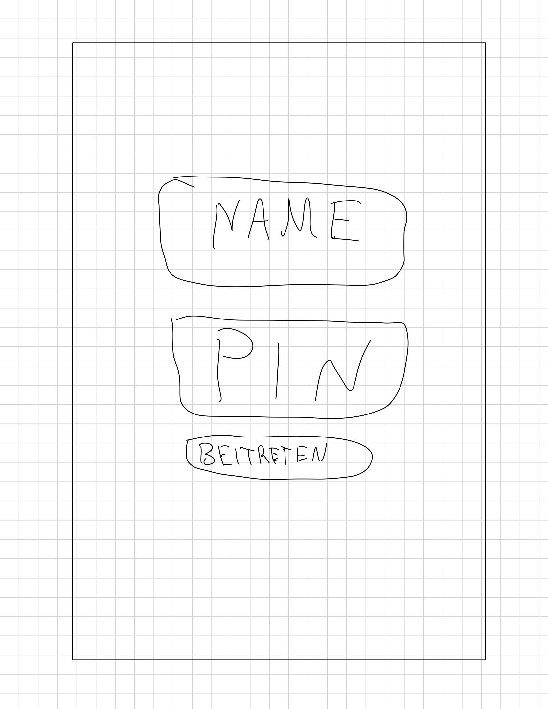
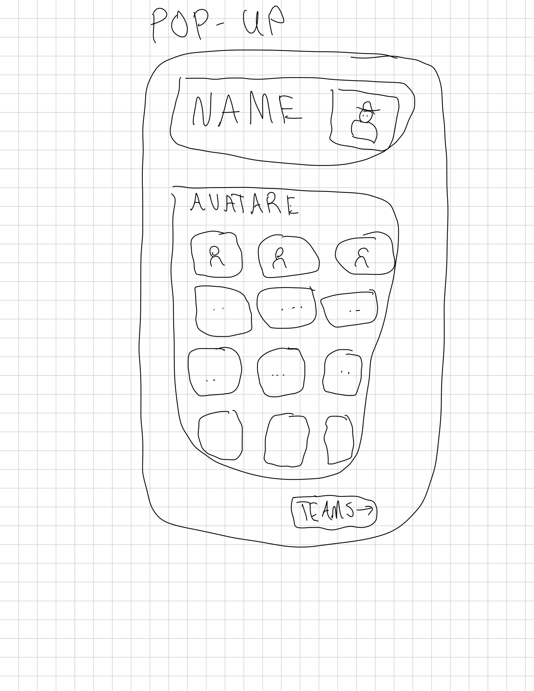
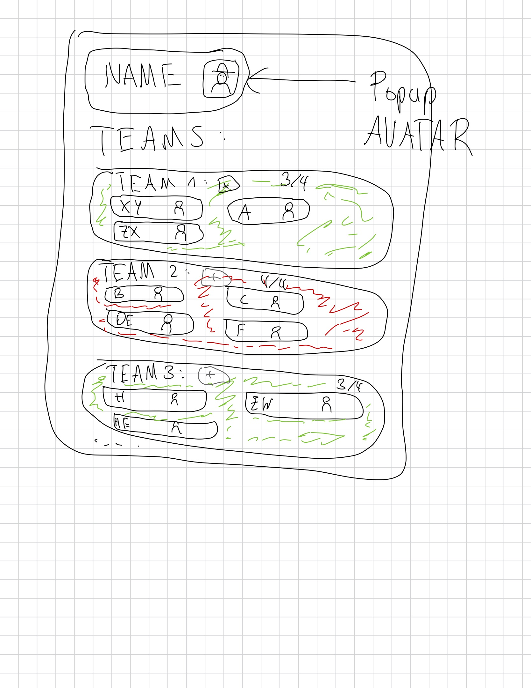
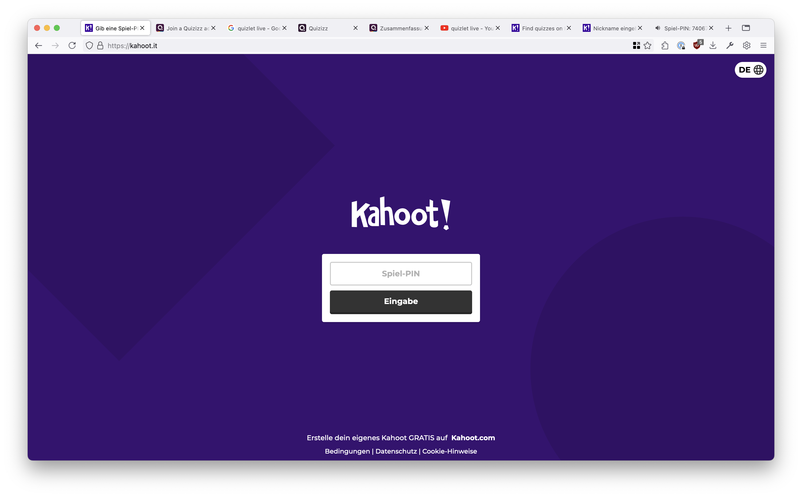
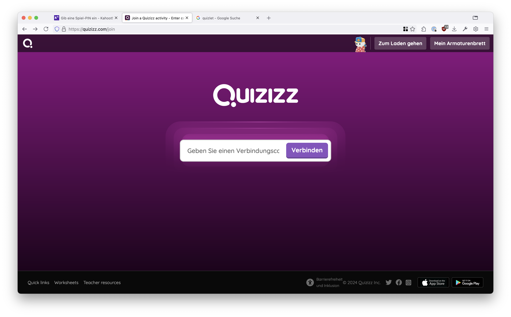
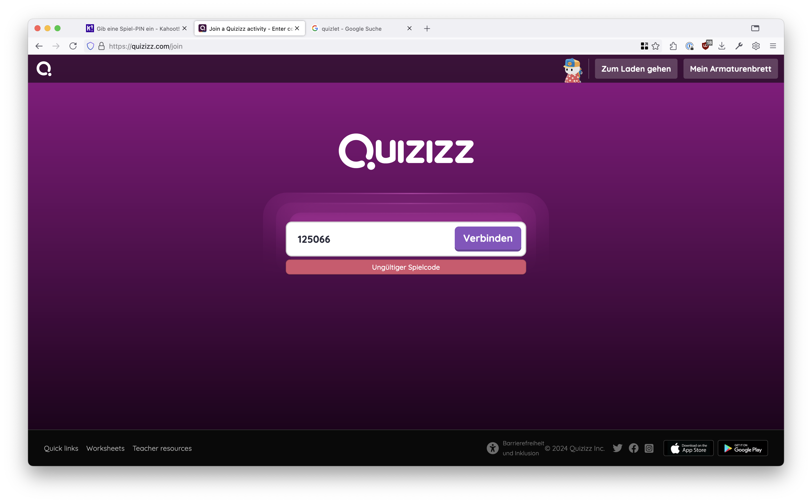
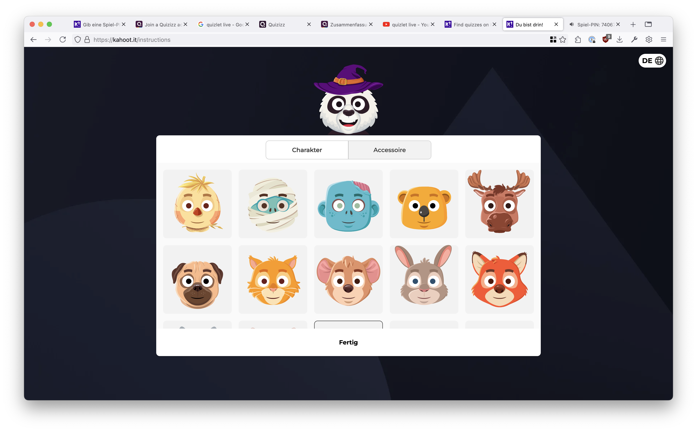
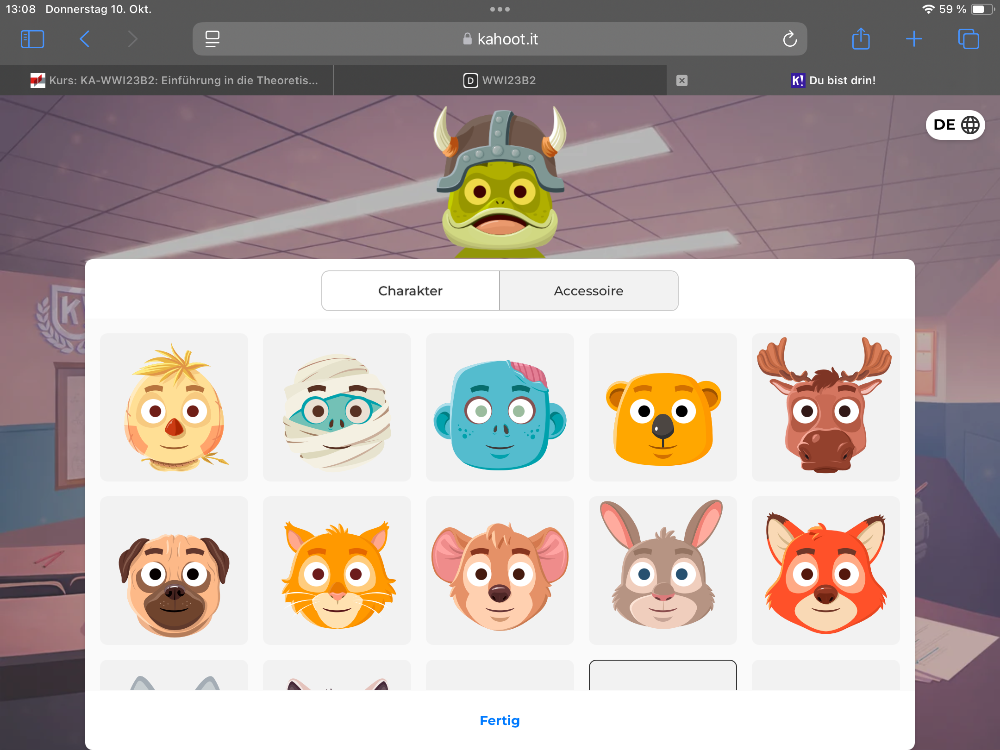
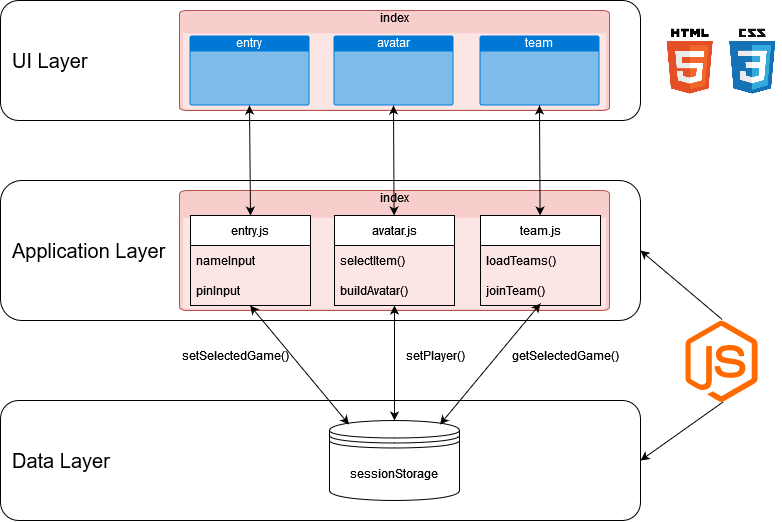

# PlayPal

Eine Webseite für Lernspiele.

## Beschreibung

Die Idee ist, den Einstieg in ein Lernspiel mit den dafür üblichen Mitteln zu gestalten.

Dies soll aus einer Seite mit der PIN-Eingabe bestehen, um einem durch einen Dozenten gestarteten
Lernspiel beizutreten. Diese Seite soll recht simple gehalten werden, da dies sowohl am Handy als auch an einem Computer
möglich sein soll. Die Seite forder außerdem zur Eingabe eines Namens, mit dem der Spieler angezeigt werden soll. 
Nach Eingabe eines Anzeigenamens ist man dem Spiel erfolgreich beigetreten.

Auf der nachfolgenden Seite, soll es den Spielern möglich sein, ihren Avatar anzupassen. Hierzu soll zu Beginn ein 
Avatar für den Spieler gesetzt sein. Wenn der Spieler nun auf seinen Avatar drückt, soll sich ein DropDown-Menü öffnen
und die verschiedenen Avatare in einer Grid-Form angeordnet anzeigen. Möchte man keine Änderungen an seinem Avatar
durchführen, kann man auch einfach direkt zum nächsten Schritt springen. Der Aufbau und die Funktionalität der
Avatarauswahl wird sich an gängigen Beispielen anderer Quiz-Tools orientiert. Daher sollen auch mögliche Designregeln
gebildet werden.

Auf der finalen Seite wird eine Teamauwahl durchgeführt. Diese erstellt basierend auf der Spielerzahl automatisch die richtige Anzahl an Teams und teilt die Spieler ein.
Hier wird nur das Spiel "simuliert", sodass alle anderen Spieler bereits einem Team zugeteilt sind und lediglich der Hauptspieler einem Team noch beitreten muss.
Die Teams mit den Nicknames ihrer Spieler sollen dann angezeigt werden, ähnlich wie bei anderen Quiz-Tools. Hierbei werden ebenfalls die Avatare der anderen Spieler angezeigt.

## Aufbau

### Spielbeitritt via PIN (Justin)

Eingabe einer Spielepin und Spielername

### Avatarauswahl (Niklas)

Auswahl und Anpassung eines eigenen Avatars

### Teamauswahl bzw. -einteilung (Torben)

Möglichkeit als Spieler einem Team beizutreten

## Design - Scribbles

  
  
  

Desktop & Mobile prinzipiell gleich: leere Zwischenräume (Hintergrund) fällt kleiner aus / Hauptcontainer nehmen den vollen Raum ein.

## UI-Pattern und Gesaltungsregeln

P = Pattern

G = Gestaltungsregel

### 1. Durchgängige Farbnutzung

- (P) Ähnlich wie bei den Screenshots soll ein kräftiges, konsistentes Farbschema auf allen Bildschirmseiten, wie bei Kahoot das kräftige Lila, verwendet werden:

  
  

- (G) Es soll ein unverwechselbares auffallendes Farbschema gewählt werden, das den Wiedererkennungswert der Website verbessert.

- (G) Das Farbschema soll auf allen Bildschirmseiten eingehalten werden, um einen visuellen Zusammenhang zu vermitteln.

### 2. Hervorgehobene Eingabefelder und Beschriftungen

- (P) Eingabefelder wie für Spiele-Pins oder den Namen werden groß und zentral positioniert:

- (G) Wichtige Eingabefelder oder Anzeigen (z.B. Eingabe der Pin, Name, Avatar- und Teamauswahl) sollen in der Mitte des Bildschirms platziert werden. 

- (G) Außerdem soll immer genügend Platz um die Komponenten sein. So soll sofort klar werden, was vom Nutzer erwartet wird. 

### 3. CTA Buttons deutlich hervorgehoben

- (P) Jeder Bildschirm hat neben der vom Nutzer erwarteten Eingabe/Aktion einen klar hervorgehobenen/erkennbaren Call-to-Action Button (bspw. lila).

- (G) Neben Eingabe-/Aktionsfeldern soll ein einzelner klarer CTA-Button sein. Der Button sollte sich in Farbe und Größe von dem Rest der Komponenten hervorheben, um leicht auffindbar zu sein. Die Beschriftungen des Button sollen Bildlich gesprochen und klar verständlich sein.

### 4. Feedback bei Fehlern

- (P) Bei Quizizz wird bei einem ungültigen Code eine Fehlermeldung in Rot ("Ungültiger Spielcode") angezeigt:

  
- (G) Bei Auftritt eines Fehlers soll dem Nutzer sofortiges Feedback gegeben werden, z.B. bei der Eingabe eines ungültigen Spiele-Pins. Hierfür sollen kontrastreiche Farben verwendet werden (rot bei quizizz, da Rot=fehler), um den Nutzer auf Fehler aufmerksam zu machen. So kann der Nutzer die Fehler selbst erkennen und korrigieren.

### 5. Responsive Gestaltung

- (P) Sowohl bei Kahoot als auch bei quizizz werden große Texte und Buttons verwendet, was die Seite auf verschiedenen Geräten leichter erkennbar macht. Diese Elemente sind nicht statisch sondern passen sich der Bildschirmauflösung an:

  
  

- (G) Es soll darauf geachtet werden ein Responsive Design zu verwenden, das große und gut klickbare Buttons, sowie lesbare Textgrößen für bessere Sichtbarkeit anbietet. Dies ist bei Lernspielen besonders wichtig, da Nutzer auf den verschiedensten Geräten am Spiel teilnehmen.

## Technische Architektur

Basis der Architektur bildet die folgende Modellierung des Front-Ends:

Die Webseite wird als Single-Page-Application mittels HTMX aufgebaut. Basis bildet die Index-Seite als "Hauptcontainer". Dieser beinhaltet entsprechenden Boilerplate Code, der auf allen Seiten angezeigt wird bzw. Skripte zentral ausführt. Darin werden mittels HTMX die einzelnen Seiten in den "main"-Teil geladen. Jede Seite hat ihren eigenen Javascript Code, um die spezifischen Dinge zu steuern. Der zentrale Skript "index.js" kümmert sich nur darum, dass die Entry-Page mit ihrem Skript zuerst geladen wird, wenn man die Seite betritt. Davon ausgehend hat jede Seite (bis auf die Teamauswahl) eine Weiterleitung zur nächsten Seite via HTMX. Der Sessionstorage und die zugehörige Javascript-Datei werden zur zentralen Speicherung von relevanten Daten genutzt. Dadurch besteht eine Datenpersistenz zwischen den Einzelseiten. Die benötigten Daten, wie etwa der eingegebene Spielepin oder der Avatar des Hauptspielers, könnten auch direkt an die Team-Page übergeben werden. Im Zuge der Datensicherheit und -korrektheit wurde sich jedoch für ein "Single Source of Truth"-Prinzip (SSOT) entschieden, sodass die Daten aus dem Sessionstorage immer die richtig und korrekt sind. Somit können potenzielle Konflikte vermieden werden. Der sharedStorage-Skript bietet die notwendigen Schnittstellen in Form von Getter und Setter für die einzelnen Seiten. So dient dieser rein die Datenverwaltung, die konkrete Modifikation, also *wie* die Datenwerte aussehen, findet in den jeweiligen Skripten der einzelnen Seiten statt. Insgesamt kümmert sich jede Seite um seine eigene Logik und der sharedStorage um die Verwaltung (read / write) der Daten.
